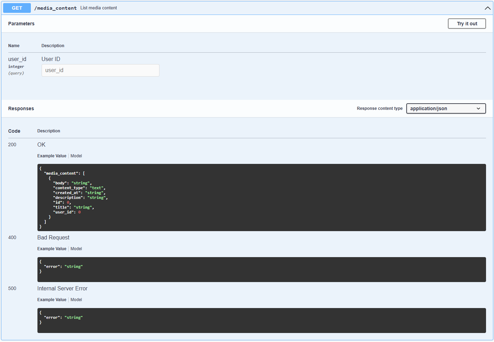

# Реалізація інформаційного та програмного забезпечення

## SQL-скрипт для створення початкового наповнення бази даних

```sql


-- MySQL Workbench Forward Engineering

SET @OLD_UNIQUE_CHECKS=@@UNIQUE_CHECKS, UNIQUE_CHECKS=0;
SET @OLD_FOREIGN_KEY_CHECKS=@@FOREIGN_KEY_CHECKS, FOREIGN_KEY_CHECKS=0;
SET @OLD_SQL_MODE=@@SQL_MODE, SQL_MODE='ONLY_FULL_GROUP_BY,STRICT_TRANS_TABLES,NO_ZERO_IN_DATE,NO_ZERO_DATE,ERROR_FOR_DIVISION_BY_ZERO,NO_ENGINE_SUBSTITUTION';

-- -----------------------------------------------------
-- Schema media_system
-- -----------------------------------------------------
DROP SCHEMA IF EXISTS `media_system` ;

-- -----------------------------------------------------
-- Schema media_system
-- -----------------------------------------------------
CREATE SCHEMA IF NOT EXISTS `media_system` DEFAULT CHARACTER SET utf8 ;
USE `media_system` ;

-- -----------------------------------------------------
-- Table `media_system`.`User`
-- -----------------------------------------------------
DROP TABLE IF EXISTS `media_system`.`User` ;

CREATE TABLE IF NOT EXISTS `media_system`.`User` (
  `id` INT NOT NULL AUTO_INCREMENT,
  `first_name` VARCHAR(45) NOT NULL,
  `last_name` VARCHAR(45) NOT NULL,
  `email` VARCHAR(45) NOT NULL,
  `password` VARCHAR(45) NOT NULL,
  PRIMARY KEY (`id`))
ENGINE = InnoDB;


-- -----------------------------------------------------
-- Table `media_system`.`MediaContent`
-- -----------------------------------------------------
DROP TABLE IF EXISTS `media_system`.`MediaContent` ;

CREATE TABLE IF NOT EXISTS `media_system`.`MediaContent` (
  `id` INT NOT NULL,
  `title` VARCHAR(45) NOT NULL,
  `description` VARCHAR(255) NULL,
  `body` VARCHAR(255) NOT NULL,
  `content_type` VARCHAR(45) NOT NULL,
  `created_at` DATE NOT NULL,
  `user_id` INT NOT NULL,
  PRIMARY KEY (`id`, `user_id`),
  INDEX `fk_MediaContent_User1_idx` (`user_id` ASC) VISIBLE,
  CONSTRAINT `fk_MediaContent_User1`
    FOREIGN KEY (`user_id`)
    REFERENCES `media_system`.`User` (`id`)
    ON DELETE NO ACTION
    ON UPDATE NO ACTION)
ENGINE = InnoDB;


-- -----------------------------------------------------
-- Table `media_system`.`Role`
-- -----------------------------------------------------
DROP TABLE IF EXISTS `media_system`.`Role` ;

CREATE TABLE IF NOT EXISTS `media_system`.`Role` (
  `id` INT NOT NULL AUTO_INCREMENT,
  `name` VARCHAR(45) NOT NULL,
  `description` VARCHAR(45) NOT NULL,
  PRIMARY KEY (`id`))
ENGINE = InnoDB;


-- -----------------------------------------------------
-- Table `media_system`.`Permission`
-- -----------------------------------------------------
DROP TABLE IF EXISTS `media_system`.`Permission` ;

CREATE TABLE IF NOT EXISTS `media_system`.`Permission` (
  `id` INT NOT NULL AUTO_INCREMENT,
  `name` VARCHAR(45) NOT NULL,
  PRIMARY KEY (`id`))
ENGINE = InnoDB;


-- -----------------------------------------------------
-- Table `media_system`.`RolePermission`
-- -----------------------------------------------------
DROP TABLE IF EXISTS `media_system`.`RolePermission` ;

CREATE TABLE IF NOT EXISTS `media_system`.`RolePermission` (
  `role_id` INT NOT NULL,
  `permission_id` INT NOT NULL,
  PRIMARY KEY (`role_id`, `permission_id`),
  INDEX `fk_RolePermission_Permission1_idx` (`permission_id` ASC) VISIBLE,
  CONSTRAINT `fk_RolePermission_Role1`
    FOREIGN KEY (`role_id`)
    REFERENCES `media_system`.`Role` (`id`)
    ON DELETE NO ACTION
    ON UPDATE NO ACTION,
  CONSTRAINT `fk_RolePermission_Permission1`
    FOREIGN KEY (`permission_id`)
    REFERENCES `media_system`.`Permission` (`id`)
    ON DELETE NO ACTION
    ON UPDATE NO ACTION)
ENGINE = InnoDB;


-- -----------------------------------------------------
-- Table `media_system`.`AnalysisReport`
-- -----------------------------------------------------
DROP TABLE IF EXISTS `media_system`.`AnalysisReport` ;

CREATE TABLE IF NOT EXISTS `media_system`.`AnalysisReport` (
  `id` INT NOT NULL AUTO_INCREMENT,
  `title` VARCHAR(45) NOT NULL,
  `body` VARCHAR(255) NOT NULL,
  `created_at` DATE NOT NULL,
  `user_id` INT NOT NULL,
  PRIMARY KEY (`id`, `user_id`),
  INDEX `fk_AnalysisReport_User1_idx` (`user_id` ASC) VISIBLE,
  CONSTRAINT `fk_AnalysisReport_User1`
    FOREIGN KEY (`user_id`)
    REFERENCES `media_system`.`User` (`id`)
    ON DELETE NO ACTION
    ON UPDATE NO ACTION)
ENGINE = InnoDB;


-- -----------------------------------------------------
-- Table `media_system`.`AnalysisResult`
-- -----------------------------------------------------
DROP TABLE IF EXISTS `media_system`.`AnalysisResult` ;

CREATE TABLE IF NOT EXISTS `media_system`.`AnalysisResult` (
  `id` INT NOT NULL AUTO_INCREMENT,
  `title` VARCHAR(45) NOT NULL,
  `description` VARCHAR(255) NULL,
  `body` VARCHAR(255) NOT NULL,
  `created_at` DATE NOT NULL,
  `analysisReport_id` INT NOT NULL,
  `user_id` INT NOT NULL,
  PRIMARY KEY (`id`, `analysisReport_id`, `user_id`),
  INDEX `fk_AnalysisResult_AnalysisReport1_idx` (`analysisReport_id` ASC) VISIBLE,
  INDEX `fk_AnalysisResult_User1_idx` (`user_id` ASC) VISIBLE,
  CONSTRAINT `fk_AnalysisResult_AnalysisReport1`
    FOREIGN KEY (`analysisReport_id`)
    REFERENCES `media_system`.`AnalysisReport` (`id`)
    ON DELETE NO ACTION
    ON UPDATE NO ACTION,
  CONSTRAINT `fk_AnalysisResult_User1`
    FOREIGN KEY (`user_id`)
    REFERENCES `media_system`.`User` (`id`)
    ON DELETE NO ACTION
    ON UPDATE NO ACTION)
ENGINE = InnoDB;


-- -----------------------------------------------------
-- Table `media_system`.`MediaContentAnalysisResult`
-- -----------------------------------------------------
DROP TABLE IF EXISTS `media_system`.`MediaContentAnalysisResult` ;

CREATE TABLE IF NOT EXISTS `media_system`.`MediaContentAnalysisResult` (
  `mediaContent_id` INT NOT NULL,
  `analysisResult_id` INT NOT NULL,
  PRIMARY KEY (`mediaContent_id`, `analysisResult_id`),
  INDEX `fk_MediaContentAnalysisResult_AnalysisResult1_idx` (`analysisResult_id` ASC) VISIBLE,
  CONSTRAINT `fk_MediaContentAnalysisResult_MediaContent1`
    FOREIGN KEY (`mediaContent_id`)
    REFERENCES `media_system`.`MediaContent` (`id`)
    ON DELETE NO ACTION
    ON UPDATE NO ACTION,
  CONSTRAINT `fk_MediaContentAnalysisResult_AnalysisResult1`
    FOREIGN KEY (`analysisResult_id`)
    REFERENCES `media_system`.`AnalysisResult` (`id`)
    ON DELETE NO ACTION
    ON UPDATE NO ACTION)
ENGINE = InnoDB;


-- -----------------------------------------------------
-- Table `media_system`.`Tag`
-- -----------------------------------------------------
DROP TABLE IF EXISTS `media_system`.`Tag` ;

CREATE TABLE IF NOT EXISTS `media_system`.`Tag` (
  `id` INT NOT NULL AUTO_INCREMENT,
  `name` VARCHAR(45) NOT NULL,
  PRIMARY KEY (`id`))
ENGINE = InnoDB;


-- -----------------------------------------------------
-- Table `media_system`.`AnalysisResultTag`
-- -----------------------------------------------------
DROP TABLE IF EXISTS `media_system`.`AnalysisResultTag` ;

CREATE TABLE IF NOT EXISTS `media_system`.`AnalysisResultTag` (
  `analysisResult_id` INT NOT NULL,
  `tag_id` INT NOT NULL,
  PRIMARY KEY (`analysisResult_id`, `tag_id`),
  INDEX `fk_AnalysisResultTag_Tag1_idx` (`tag_id` ASC) VISIBLE,
  CONSTRAINT `fk_AnalysisResultTag_AnalysisResult1`
    FOREIGN KEY (`analysisResult_id`)
    REFERENCES `media_system`.`AnalysisResult` (`id`)
    ON DELETE NO ACTION
    ON UPDATE NO ACTION,
  CONSTRAINT `fk_AnalysisResultTag_Tag1`
    FOREIGN KEY (`tag_id`)
    REFERENCES `media_system`.`Tag` (`id`)
    ON DELETE NO ACTION
    ON UPDATE NO ACTION)
ENGINE = InnoDB;


-- -----------------------------------------------------
-- Table `media_system`.`Source`
-- -----------------------------------------------------
DROP TABLE IF EXISTS `media_system`.`Source` ;

CREATE TABLE IF NOT EXISTS `media_system`.`Source` (
  `id` INT NOT NULL AUTO_INCREMENT,
  `name` VARCHAR(45) NOT NULL,
  `url` VARCHAR(45) NOT NULL,
  PRIMARY KEY (`id`))
ENGINE = InnoDB;


-- -----------------------------------------------------
-- Table `media_system`.`SourceTag`
-- -----------------------------------------------------
DROP TABLE IF EXISTS `media_system`.`SourceTag` ;

CREATE TABLE IF NOT EXISTS `media_system`.`SourceTag` (
  `tag_id` INT NOT NULL,
  `source_id` INT NOT NULL,
  PRIMARY KEY (`tag_id`, `source_id`),
  INDEX `fk_SourceTag_Source1_idx` (`source_id` ASC) VISIBLE,
  CONSTRAINT `fk_SourceTag_Tag1`
    FOREIGN KEY (`tag_id`)
    REFERENCES `media_system`.`Tag` (`id`)
    ON DELETE NO ACTION
    ON UPDATE NO ACTION,
  CONSTRAINT `fk_SourceTag_Source1`
    FOREIGN KEY (`source_id`)
    REFERENCES `media_system`.`Source` (`id`)
    ON DELETE NO ACTION
    ON UPDATE NO ACTION)
ENGINE = InnoDB;


-- -----------------------------------------------------
-- Table `media_system`.`MediaContentTag`
-- -----------------------------------------------------
DROP TABLE IF EXISTS `media_system`.`MediaContentTag` ;

CREATE TABLE IF NOT EXISTS `media_system`.`MediaContentTag` (
  `tag_id` INT NOT NULL,
  `mediaContent_id` INT NOT NULL,
  PRIMARY KEY (`tag_id`, `mediaContent_id`),
  INDEX `fk_MediaContentTag_MediaContent1_idx` (`mediaContent_id` ASC) VISIBLE,
  CONSTRAINT `fk_MediaContentTag_Tag1`
    FOREIGN KEY (`tag_id`)
    REFERENCES `media_system`.`Tag` (`id`)
    ON DELETE NO ACTION
    ON UPDATE NO ACTION,
  CONSTRAINT `fk_MediaContentTag_MediaContent1`
    FOREIGN KEY (`mediaContent_id`)
    REFERENCES `media_system`.`MediaContent` (`id`)
    ON DELETE NO ACTION
    ON UPDATE NO ACTION)
ENGINE = InnoDB;


-- -----------------------------------------------------
-- Table `media_system`.`MediaContentSource`
-- -----------------------------------------------------
DROP TABLE IF EXISTS `media_system`.`MediaContentSource` ;

CREATE TABLE IF NOT EXISTS `media_system`.`MediaContentSource` (
  `source_id` INT NOT NULL,
  `mediaContent_id` INT NOT NULL,
  PRIMARY KEY (`source_id`, `mediaContent_id`),
  INDEX `fk_MediaContentSource_MediaContent1_idx` (`mediaContent_id` ASC) VISIBLE,
  CONSTRAINT `fk_MediaContentSource_Source1`
    FOREIGN KEY (`source_id`)
    REFERENCES `media_system`.`Source` (`id`)
    ON DELETE NO ACTION
    ON UPDATE NO ACTION,
  CONSTRAINT `fk_MediaContentSource_MediaContent1`
    FOREIGN KEY (`mediaContent_id`)
    REFERENCES `media_system`.`MediaContent` (`id`)
    ON DELETE NO ACTION
    ON UPDATE NO ACTION)
ENGINE = InnoDB;


-- -----------------------------------------------------
-- Table `media_system`.`UserRole`
-- -----------------------------------------------------
DROP TABLE IF EXISTS `media_system`.`UserRole` ;

CREATE TABLE IF NOT EXISTS `media_system`.`UserRole` (
  `user_id` INT NOT NULL,
  `role_id` INT NOT NULL,
  PRIMARY KEY (`user_id`, `role_id`),
  INDEX `fk_UserRole_Role1_idx` (`role_id` ASC) VISIBLE,
  CONSTRAINT `fk_UserRole_User1`
    FOREIGN KEY (`user_id`)
    REFERENCES `media_system`.`User` (`id`)
    ON DELETE NO ACTION
    ON UPDATE NO ACTION,
  CONSTRAINT `fk_UserRole_Role1`
    FOREIGN KEY (`role_id`)
    REFERENCES `media_system`.`Role` (`id`)
    ON DELETE NO ACTION
    ON UPDATE NO ACTION)
ENGINE = InnoDB;


-- -----------------------------------------------------
-- Table `media_system`.`AnalysisReportTag`
-- -----------------------------------------------------
DROP TABLE IF EXISTS `media_system`.`AnalysisReportTag` ;

CREATE TABLE IF NOT EXISTS `media_system`.`AnalysisReportTag` (
  `analysisReport_id` INT NOT NULL,
  `tag_id` INT NOT NULL,
  PRIMARY KEY (`analysisReport_id`, `tag_id`),
  INDEX `fk_AnalysisReportTag_Tag1_idx` (`tag_id` ASC) VISIBLE,
  CONSTRAINT `fk_AnalysisReportTag_AnalysisReport1`
    FOREIGN KEY (`analysisReport_id`)
    REFERENCES `media_system`.`AnalysisReport` (`id`)
    ON DELETE NO ACTION
    ON UPDATE NO ACTION,
  CONSTRAINT `fk_AnalysisReportTag_Tag1`
    FOREIGN KEY (`tag_id`)
    REFERENCES `media_system`.`Tag` (`id`)
    ON DELETE NO ACTION
    ON UPDATE NO ACTION)
ENGINE = InnoDB;


SET SQL_MODE=@OLD_SQL_MODE;
SET FOREIGN_KEY_CHECKS=@OLD_FOREIGN_KEY_CHECKS;
SET UNIQUE_CHECKS=@OLD_UNIQUE_CHECKS;


-- Fill database with data
USE media_system

START TRANSACTION;

-- User table
INSERT INTO User (id, first_name, last_name, email, password) VALUES
(1, 'Vladyslav', 'Sokolov', 'pppvladsok@gmail.com', 'vlada1976'),
(2, 'John', 'Doe', 'john.doe2000@gmail.com', '756433456'),
(3, 'Veronica', 'Shevchenko', 'lapamapa@ukr.net', 'geog21224'),
(4, 'Fiona', 'Martinez', 'fiona.martinez2@gmail.com', 'fieNa231'),
(5, 'Bob', 'Brown', 'cliriks@gmail.com', 'mamaaa1945'),
(6, 'David', 'Soloh', 'davasolom@gmail.com', 'timetorest'),
(7, 'Sergey', 'Semenyaka', 's.semenyaka@gmail.com', 'bazovichok222'),
(8, 'Anastasia', 'Golovchenko', 'ddd.anasnata@gmail.com', 'adacjavasj2'),
(9, 'Elena', 'Kovalenko', 'elena.kovalenko@gmail.com', 'kovalenko88'),
(10, 'Alex', 'Petrenko', 'alex.petr@yahoo.com', 'alexpass123');

-- Role table
INSERT INTO Role (id, name, description) VALUES
(1, 'User', 'An ordinary user of the system'),
(2, 'TechnicalExpert', 'Specialist in technical issues');

-- Permisson table
INSERT INTO Permission (id, name) VALUES
(1, 'user.role.promote'),
(2, 'user.delete'),
(3, 'content.create'),
(4, 'content.search'),
(5, 'content.update'),
(6, 'content.delete');

-- Tag table
INSERT INTO Tag (id, name) VALUES
(1, 'Science'),
(2, 'Technology'),
(3, 'Health'),
(4, 'Travel'),
(5, 'Environment'),
(6, 'Space Exploration'),
(7, 'Quantum Computing'),
(8, 'Renewable Energy'),
(9, 'Gaming'),
(10, 'Medicine'),
(11, 'Market Analysis'),
(12, 'Customer Insights'),
(13, 'Product Launch'),
(14, 'Sales Projections'),
(15, 'Employee Feedback'),
(16, 'Social Media'),
(17, 'Competitor Analysis'),
(18, 'Logistics'),
(19, 'User Experience');

-- Source table
INSERT INTO Source (id, name, url) VALUES
(1, 'National Geographic', 'https://www.nationalgeographic.com'),
(2, 'TechCrunch', 'https://techcrunch.com'),
(3, 'NASA', 'https://www.nasa.gov'),
(4, 'Healthline', 'https://www.healthline.com'),
(5, 'Quanta Magazine', 'https://www.quantamagazine.org'),
(6, 'TripAdvisor', 'https://www.tripadvisor.com'),
(7, 'YouTube', 'https://www.youtube.com'),
(8, 'GameSpot', 'https://www.gamespot.com'),
(9, 'PlayStation Blog', 'https://blog.playstation.com'),
(10, 'MedTech News', 'https://www.medtechnews.com');

-- MediaContent table
INSERT INTO MediaContent (`id`, `title`, `description`, `body`, `content_type`, `created_at`, `user_id`) VALUES
(1, 'Exploring the Ocean Depths', 'A comprehensive dive into the mysteries of the deep sea.', 'The ocean s depths hold secrets yet to be uncovered, from bioluminescent creatures to uncharted trenches. This exploration reveals the enigmatic wonders beneath the waves.', 'Article', '2024-11-01', 1),
(2, 'Advancements in AI', 'Recent breakthroughs in artificial intelligence technology.', 'AI advancements are reshaping our world, from smart assistants to autonomous vehicles. Cutting-edge algorithms and deep learning are driving this technological revolution.', 'Article', '2024-11-02', 2),
(3, 'History of Space Exploration', 'From the Moon landing to Mars missions.', 'https://youtu.be/3JuKR7jf46o?si=-eG_l82dAemgaZdW', 'Video', '2024-11-03', 3),
(4, 'Healthy Living Tips', 'Simple steps to improve your health and wellbeing.', 'https://www.healthline.com/health/how-to-maintain-a-healthy-lifestyle', 'Blog Post', '2024-11-04', 4),
(5, 'Understanding Quantum Computing', 'An introduction to the principles of quantum computing.', 'Quantum computing harnesses the power of quantum mechanics to process information in fundamentally new ways, promising exponential advances in speed and problem-solving capabilities.', 'Article', '2024-11-05', 5),
(6, 'Top 25 Travel Destinations', 'A list of must-visit places around the world.', 'https://www.tripadvisor.com/TravelersChoice-Destinations-cTop-g1', 'Blog Post', '2024-12-06', 6),
(7, 'The Future of Renewable Energy', 'How renewable energy sources are shaping our future.', 'https://youtu.be/zZheOMvPWGc?si=3C6qQHf-jUApOgB0', 'Video', '2024-12-07', 7),
(8, 'Cyberpunk Cityscape', 'A futuristic city teeming with life, neon lights, and advanced technology, showcasing a blend of high-rise buildings, flying cars, and bustling streets.', 'https://www.gamespot.com/a/uploads/original/1179/11799911/4363244-cyberpunk1.jpg', 'Image', '2024-12-08', 8),
(9, 'Epic Battle in Snowy Terrain', 'An intense battle between a warrior and a fierce opponent in a frozen, mountainous landscape.', 'https://blog.playstation.com/tachyon/2024/09/c31c0e1cae38ef6a23c353e31d87e8b1cd57b700.jpeg', 'Image', '2024-12-09', 9),
(10, 'Innovations in Healthcare', 'New technologies improving patient care.', 'Healthcare innovations like telemedicine and personalized treatments are revolutionizing patient care, enhancing accessibility, and improving outcomes for various medical conditions.', 'Article', '2024-12-10', 10);

-- AnalysisReport table
INSERT INTO AnalysisReport (`id`, `title`, `body`, `created_at`, `user_id`) VALUES
(1, 'Quarterly Performance Analysis', 'In-depth analysis of quarterly performance.', '2024-01-01', 1),
(2, 'Market Trend Report', 'Overview of market trends for the current quarter.', '2024-01-02', 2),
(3, 'Customer Feedback Summary', 'Compilation of recent customer feedback.', '2024-01-03', 1),
(4, 'Product Launch Analysis', 'Analysis of the latest product launch success.', '2024-01-04', 3),
(5, 'Annual Revenue Forecast', 'Forecast based on historical data and market trends.', '2024-01-05', 2),
(6, 'Employee Satisfaction Report', 'Analysis of recent employee satisfaction survey.', '2024-01-06', 4),
(7, 'Social Media Impact Study', 'Impact analysis of social media campaigns.', '2024-01-07', 1),
(8, 'Competitor Benchmarking', 'Comparison of our product against competitors.', '2024-01-08', 3),
(9, 'Supply Chain Efficiency', 'Evaluation of supply chain performance and bottlenecks.', '2024-01-09', 4),
(10, 'Website Traffic Analysis', 'Insight into website traffic and user behavior.', '2024-01-10', 2);

-- RolePermisson table
INSERT INTO RolePermission (role_id, permission_id) VALUES
(2, 1),
(2, 2),
(1, 3),
(2, 3),
(1, 4),
(2, 4),
(1, 5),
(2, 5),
(1, 6),
(2, 6);

-- UserRole table
INSERT INTO `UserRole` (`user_id`, `role_id`) VALUES
(1, 1), (1, 2),
(2, 2),
(3, 1), (3, 2),
(4, 1),
(5, 2),
(6, 1),
(7, 2),
(8, 1), (8, 2);

-- AnalysisResult table
INSERT INTO AnalysisResult (`id`, `title`, `description`, `body`, `created_at`, `analysisReport_id`, `user_id`) VALUES
(1, 'Q1 Growth Factors', 'Identified factors contributing to growth in Q1.', 'Analysis highlights key growth drivers.', '2024-02-01', 1, 1),
(2, 'Emerging Markets Overview', 'Details on potential emerging markets.', 'Summary of trends in new markets.', '2024-02-02', 2, 2),
(3, 'Top Customer Concerns', 'Key issues raised by customers recently.', 'Detailed analysis of common customer issues.', '2024-02-03', 3, 1),
(4, 'Launch Day Performance', 'Performance metrics on product launch day.', 'In-depth analysis of initial product success.', '2024-02-04', 4, 3),
(5, 'Projected Sales for Q3', 'Sales projection for the next quarter.', 'Data-driven sales projections based on trends.', '2024-02-05', 5, 2),
(6, 'Employee Morale Trends', 'Insights from recent employee feedback.', 'Analysis shows recent morale trends.', '2024-02-06', 6, 4),
(7, 'Social Media Engagement', 'Performance of recent social campaigns.', 'Highlights of user engagement metrics.', '2024-02-07', 7, 1),
(8, 'Competitor Price Comparison', 'Price benchmarking against competitors.', 'Comparative analysis of pricing structures.', '2024-02-08', 8, 3),
(9, 'Logistics Efficiency Review', 'Evaluation of logistics and delivery times.', 'Identified delays in supply chain process.', '2024-02-09', 9, 4),
(10, 'User Journey Insights', 'Behavioral insights on user website journey.', 'Detailed report on user interactions.', '2024-02-10', 10, 2);

-- MediaContentAnalysisResult table
INSERT INTO MediaContentAnalysisResult (mediaContent_id, analysisResult_id) VALUES
(1, 1),
(2, 2),
(3, 3),
(4, 4),
(5, 5),
(6, 6),
(7, 7),
(8, 8),
(9, 9),
(10, 10),
(1, 2),
(2, 3),
(3, 4),
(4, 5),
(5, 6),
(6, 7),
(7, 8),
(8, 9),
(9, 10),
(10, 1);

-- MediaContentSource table
INSERT INTO MediaContentSource (source_id, mediaContent_id) VALUES
(1, 1), (1, 10),
(2, 2), (2, 9),
(3, 3), (3, 8),
(4, 4), (4, 7),
(5, 5), (5, 6),
(6, 6), (6, 5),
(7, 7), (7, 4),
(8, 8), (8, 3),
(9, 9), (9, 2),
(10, 10), (10, 1);

-- AnalysisResultTag table
INSERT INTO AnalysisResultTag (`analysisResult_id`, `tag_id`) VALUES
(1, 1),
(1, 11),
(2, 5),
(2, 11),
(3, 12),
(4, 13),
(5, 14),
(6, 3),
(6, 15),
(7, 16),
(8, 17),
(9, 18),
(10, 2),
(10, 19);

-- AnalysisReportTag table
INSERT INTO AnalysisReportTag (analysisReport_id, tag_id) VALUES
(1, 2),
(2, 2),
(3, 3),
(4, 2),
(5, 8),
(6, 3),
(7, 2),
(8, 1),
(9, 8),
(10, 2);

-- MediaContentTag table
INSERT INTO MediaContentTag (tag_id, mediaContent_id) VALUES
(1, 1),
(1, 2),
(1, 3),
(1, 5),
(1, 7),
(1, 10),
(2, 2),
(2, 3),
(2, 4),
(2, 5),
(2, 7),
(2, 10),
(3, 4),
(3, 10),
(4, 6),
(5, 1),
(5, 7),
(6, 3),
(7, 5),
(8, 7),
(9, 8),
(9,9),
(10, 4),
(10, 10);

-- SourceTag table
INSERT INTO SourceTag (tag_id, source_id) VALUES
(1, 1),
(1, 3),
(1, 4),
(1, 10),
(2, 2),
(2, 3),
(2, 4),
(2, 5),
(2, 10),
(3, 4),
(3, 10),
(4, 1),
(4, 6),
(5, 1),
(6, 1),
(6, 3),
(7, 2),
(7, 5),
(8, 1),
(9, 8),
(9, 9),
(10, 4),
(10, 10);

COMMIT;


```

## RESTfull сервіс для управління даними

### Схема бази даних (goose migration)

sql/schema/001_users.sql

```sql
-- +goose Up
CREATE TABLE users (
    id SERIAL PRIMARY KEY,
    first_name VARCHAR(45) NOT NULL,
    last_name VARCHAR(45) NOT NULL,
    email VARCHAR(45) UNIQUE NOT NULL,
    password CHAR(60) NOT NULL
);

-- +goose Down
DROP TABLE users;
```

sql/schema/002_media_content.sql

```sql
-- +goose Up
CREATE TABLE users (
    id SERIAL PRIMARY KEY,
    first_name VARCHAR(45) NOT NULL,
    last_name VARCHAR(45) NOT NULL,
    email VARCHAR(45) UNIQUE NOT NULL,
    password CHAR(60) NOT NULL
);

-- +goose Down
DROP TABLE users;
```

### Запити до бази даних (sqlc queries)

sql/queries/users.sql

```sql
-- name: CreateUser :one
INSERT INTO users
    (first_name, last_name, email, password)
VALUES
    ($1, $2, $3, $4)
RETURNING *;

-- name: ListUsers :many
SELECT *
FROM users
ORDER BY id;

-- name: GetUserById :one
SELECT *
FROM users
WHERE id = $1;

-- name: UpdateUserById :one
UPDATE users
SET
    first_name = $2,
    last_name = $3,
    email = $4,
    password = $5
WHERE
    id = $1
RETURNING *;

-- name: DeleteUserById :exec
DELETE FROM users
WHERE id = $1;
```

sql/queries/media_content.sql

```sql
-- name: CreateMediaContent :one
INSERT INTO media_content
    (title, description, body, content_type, created_at, user_id)
VALUES
    ($1, $2, $3, $4, NOW(), $5)
RETURNING *;

-- name: ListMediaContent :many
SELECT *
FROM media_content
ORDER BY id;

-- name: GetMediaContentById :one
SELECT *
FROM media_content
WHERE id = $1;

-- name: ListMediaContentByUserId :many
SELECT *
FROM media_content
WHERE user_id = $1
ORDER BY id;

-- name: DeleteMediaContentById :exec
DELETE FROM media_content
WHERE id = $1;
```

### Згенеровані моделі

internal/database/models.go

```go
type MediaContent struct {
	ID          int32
	Title       string
	Description sql.NullString
	Body        string
	ContentType string
	CreatedAt   time.Time
	UserID      int32
}

type User struct {
	ID        int32
	FirstName string
	LastName  string
	Email     string
	Password  string
}
```

### Адаптер для взаємодії з базою даних користувача

internal/database/adapter.go

```go
func (db DB) CreateUser(ctx context.Context, firstName, lastName, email string, hashedPassword [types.PasswordMaxLen]byte) (types.User, error) {
	if len(firstName) > types.NameMaxLen {
		return types.User{}, types.ErrNameTooLong
	}
	if len(lastName) > types.NameMaxLen {
		return types.User{}, types.ErrNameTooLong
	}
	if len(email) > types.EmailMaxLen {
		return types.User{}, types.ErrEmailTooLong
	}

	u, err := db.q.CreateUser(ctx, CreateUserParams{
		FirstName: firstName,
		LastName:  lastName,
		Email:     email,
		Password:  string(hashedPassword[:]),
	})
	if err != nil {
		if pqErr, ok := err.(*pq.Error); ok {
			if pqErr.Code.Name() == "unique_violation" {
				return types.User{}, types.ErrUserEmailExists
			}
		}
		return types.User{}, err
	}
	return userToTypes(u), nil
}

func (db DB) ListUsers(ctx context.Context) ([]types.User, error) {
	dbUsers, err := db.q.ListUsers(ctx)
	if err != nil {
		return nil, err
	}
	users := make([]types.User, len(dbUsers))
	for i, dbUser := range dbUsers {
		users[i] = userToTypes(dbUser)
	}
	return users, nil
}

func (db DB) GetUserById(ctx context.Context, id int32) (types.User, error) {
	u, err := db.q.GetUserById(ctx, id)
	if err != nil {
		if err == sql.ErrNoRows {
			return types.User{}, types.ErrUserIdNotExists
		}
		return types.User{}, err
	}
	return userToTypes(u), nil
}

func (db DB) UpdateUserById(ctx context.Context, id int32, firstName, lastName, email string, hashedPassword [60]byte) (types.User, error) {
	if len(firstName) > types.NameMaxLen {
		return types.User{}, types.ErrNameTooLong
	}
	if len(lastName) > types.NameMaxLen {
		return types.User{}, types.ErrNameTooLong
	}
	if len(email) > types.EmailMaxLen {
		return types.User{}, types.ErrEmailTooLong
	}

	u, err := db.q.UpdateUserById(ctx, UpdateUserByIdParams{
		ID:        id,
		FirstName: firstName,
		LastName:  lastName,
		Email:     email,
		Password:  string(hashedPassword[:]),
	})
	if err != nil {
		if err == sql.ErrNoRows {
			return types.User{}, types.ErrUserIdNotExists
		}
		if pqErr, ok := err.(*pq.Error); ok {
			if pqErr.Code.Name() == "unique_violation" {
				return types.User{}, types.ErrUserEmailExists
			}
		}
		return types.User{}, err
	}
	return userToTypes(u), nil
}

func (db DB) DeleteUserById(ctx context.Context, id int32) error {
	err := db.q.DeleteUserById(ctx, id)
	if err != nil {
		if pqErr, ok := err.(*pq.Error); ok {
			if pqErr.Code.Name() == "foreign_key_violation" {
				return types.ErrUserFKConstraint
			}
		}
	}
	return err
}
```

### Адаптер для взаємодії з базою даних медіа-контенту

internal/database/adapter.go

```go
func (db DB) CreateMediaContent(
	ctx context.Context, title string, description sql.NullString, body string, mcType types.MediaContentType, userId int32,
) (types.MediaContent, error) {
	if len(title) > types.TitleMaxLen {
		return types.MediaContent{}, types.ErrTitleTooLong
	}
	if description.Valid {
		if len(description.String) > types.DescriptionMaxLen {
			return types.MediaContent{}, types.ErrDescriptionTooLong
		}
	}

	mc, err := db.q.CreateMediaContent(ctx, CreateMediaContentParams{
		Title:       title,
		Description: description,
		Body:        body,
		ContentType: mcType.String(),
		UserID:      userId,
	})
	if err != nil {
		if pqErr, ok := err.(*pq.Error); ok {
			if pqErr.Code.Name() == "foreign_key_violation" {
				return types.MediaContent{}, types.ErrUserIdNotExists
			}
		}
		return types.MediaContent{}, err
	}
	return mediaContentToTypes(mc), nil
}

func (db DB) ListMediaContent(ctx context.Context) ([]types.MediaContent, error) {
	dbMediaContent, err := db.q.ListMediaContent(ctx)
	if err != nil {
		return nil, err
	}
	mediaContent := make([]types.MediaContent, len(dbMediaContent))
	for i, dbMediaContent := range dbMediaContent {
		mediaContent[i] = mediaContentToTypes(dbMediaContent)
	}
	return mediaContent, nil
}

func (db DB) ListMediaContentByUserId(ctx context.Context, userID int32) ([]types.MediaContent, error) {
	dbMediaContent, err := db.q.ListMediaContentByUserId(ctx, userID)
	if err != nil {
		return nil, err
	}
	mediaContent := make([]types.MediaContent, len(dbMediaContent))
	for i, dbMediaContent := range dbMediaContent {
		mediaContent[i] = mediaContentToTypes(dbMediaContent)
	}
	return mediaContent, nil
}

func (db DB) GetMediaContentById(ctx context.Context, id int32) (types.MediaContent, error) {
	mc, err := db.q.GetMediaContentById(ctx, id)
	if err != nil {
		if err == sql.ErrNoRows {
			return types.MediaContent{}, types.ErrMediaContentIdNotExists
		}
		return types.MediaContent{}, err
	}
	return mediaContentToTypes(mc), nil
}

func (db DB) DeleteMediaContentById(ctx context.Context, id int32) error {
	return db.q.DeleteMediaContentById(ctx, id)
}
```

### Обробники запитів для взаємодії з адаптером користувача

internal/handlers/users.go

```go
type UserStorage interface {
	CreateUser(ctx context.Context, firstName, lastName, email string, hashedPassword [60]byte) (types.User, error)
	ListUsers(ctx context.Context) ([]types.User, error)
	GetUserById(ctx context.Context, id int32) (types.User, error)
	UpdateUserById(ctx context.Context, id int32, firstName, lastName, email string, hashedPassword [60]byte) (types.User, error)
	DeleteUserById(ctx context.Context, id int32) error
}

type UserService struct {
	db UserStorage
}

func NewUserService(db UserStorage) *UserService {
	return &UserService{
		db: db,
	}
}


type CreateUserRequest struct {
	FirstName string `json:"first_name"`
	LastName  string `json:"last_name"`
	Email     string `json:"email"`
	Password  string `json:"password"`
}

func (s UserService) CreateUser(w http.ResponseWriter, r *http.Request) {
	var req CreateUserRequest
	if err := api.DecodeJSON(r, &req); err != nil {
		api.WriteErrorf(w, http.StatusBadRequest, err.Error())
		return
	}

	if req.Email == "" {
		api.WriteErrorf(w, http.StatusBadRequest, "empty email")
		return
	}
	if req.FirstName == "" {
		api.WriteErrorf(w, http.StatusBadRequest, "empty first name")
		return
	}
	if req.LastName == "" {
		api.WriteErrorf(w, http.StatusBadRequest, "empty last name")
		return
	}
	if req.Password == "" {
		api.WriteErrorf(w, http.StatusBadRequest, "empty password")
		return
	}
	if !valid.Email(req.Email) {
		api.WriteErrorf(w, http.StatusBadRequest, "invalid email")
		return
	}

	hashedPassword, err := bcrypt.GenerateFromPassword([]byte(req.Password), bcrypt.DefaultCost)
	if err != nil {
		if errors.Is(err, bcrypt.ErrPasswordTooLong) {
			api.WriteErrorf(w, http.StatusBadRequest, "password length exceeds 72 characters")
			return
		}

		api.WriteErrorf(w, http.StatusInternalServerError, "CreateUser: %v", err)
		return
	}

	user, err := s.db.CreateUser(r.Context(), req.FirstName, req.LastName, req.Email, [60]byte(hashedPassword))
	if err != nil {
		if errors.Is(err, types.ErrNameTooLong) {
			api.WriteErrorf(w, http.StatusBadRequest, "first or last name cannot be longer than %d characters", types.NameMaxLen)
			return
		}
		if errors.Is(err, types.ErrEmailTooLong) {
			api.WriteErrorf(w, http.StatusBadRequest, "email cannot be longer than %d characters", types.EmailMaxLen)
			return
		}
		if errors.Is(err, types.ErrUserEmailExists) {
			api.WriteErrorf(w, http.StatusBadRequest, "user with this email already exists")
			return
		}

		api.WriteErrorf(w, http.StatusInternalServerError, "CreateUser: %v", err)
		return
	}

	api.WriteJSON(w, http.StatusCreated, user)
}


type ListUsersResponse struct {
	Users []types.User `json:"users"`
}

func (s UserService) ListUsers(w http.ResponseWriter, r *http.Request) {
	users, err := s.db.ListUsers(r.Context())
	if err != nil {
		api.WriteErrorf(w, http.StatusInternalServerError, "ListUsers: %v", err)
		return
	}

	api.WriteJSON(w, http.StatusOK, ListUsersResponse{users})
}

func (s UserService) GetUser(w http.ResponseWriter, r *http.Request) {
	idS := r.PathValue("id")
	if idS == "" {
		panic("empty id path value")
	}

	id, err := getId(idS)
	if err != nil {
		api.WriteErrorf(w, http.StatusBadRequest, err.Error())
		return
	}

	user, err := s.db.GetUserById(r.Context(), id)
	if err != nil {
		if errors.Is(err, types.ErrUserIdNotExists) {
			api.WriteErrorf(w, http.StatusNotFound, "user with this id was not found")
			return
		}

		api.WriteErrorf(w, http.StatusInternalServerError, "GetUser: %v", err)
		return
	}

	api.WriteJSON(w, http.StatusOK, user)
}


type UpdateUserRequest struct {
	FirstName string `json:"first_name"`
	LastName  string `json:"last_name"`
	Email     string `json:"email"`
	Password  string `json:"password"`
}

func (s UserService) UpdateUser(w http.ResponseWriter, r *http.Request) {
	idS := r.PathValue("id")
	if idS == "" {
		panic("empty id path value")
	}

	id, err := getId(idS)
	if err != nil {
		api.WriteErrorf(w, http.StatusBadRequest, err.Error())
		return
	}

	dbResCh := make(chan struct {
		user types.User
		err  error
	}, 1)
	go func() {
		newUser, err := s.db.GetUserById(r.Context(), id)
		dbResCh <- struct {
			user types.User
			err  error
		}{newUser, err}
	}()

	var req UpdateUserRequest
	if err := api.DecodeJSON(r, &req); err != nil {
		api.WriteErrorf(w, http.StatusBadRequest, err.Error())
		return
	}

	dbRes := <-dbResCh
	newUser := dbRes.user
	err = dbRes.err
	if err != nil {
		if errors.Is(err, types.ErrUserIdNotExists) {
			api.WriteErrorf(w, http.StatusNotFound, "user with this id was not found")
			return
		}
		api.WriteErrorf(w, http.StatusInternalServerError, "UpdateUser: %v", err)
		return
	}

	if req.Email != "" {
		if !valid.Email(req.Email) {
			api.WriteErrorf(w, http.StatusBadRequest, "invalid email")
			return
		}
		newUser.Email = req.Email
	}
	if req.FirstName != "" {
		newUser.FirstName = req.FirstName
	}
	if req.LastName != "" {
		newUser.LastName = req.LastName
	}
	newPassword := [60]byte([]byte(newUser.Password))
	if req.Password != "" {
		hashedPassword, err := bcrypt.GenerateFromPassword([]byte(req.Password), bcrypt.DefaultCost)
		if err != nil {
			if errors.Is(err, bcrypt.ErrPasswordTooLong) {
				api.WriteErrorf(w, http.StatusBadRequest, "password length exceeds 72 bytes")
				return
			}

			api.WriteErrorf(w, http.StatusInternalServerError, "UpdateUser: %v", err)
			return
		}

		newPassword = [60]byte(hashedPassword)
	}

	user, err := s.db.UpdateUserById(r.Context(), int32(id), newUser.FirstName, newUser.LastName, newUser.Email, newPassword)
	if err != nil {
		if errors.Is(err, types.ErrNameTooLong) {
			api.WriteErrorf(w, http.StatusBadRequest, "first or last name cannot be longer than %d characters", types.NameMaxLen)
			return
		}
		if errors.Is(err, types.ErrEmailTooLong) {
			api.WriteErrorf(w, http.StatusBadRequest, "email cannot be longer than %d characters", types.EmailMaxLen)
			return
		}
		if errors.Is(err, types.ErrUserEmailExists) {
			api.WriteErrorf(w, http.StatusBadRequest, "this email is already in use")
			return
		}

		api.WriteErrorf(w, http.StatusInternalServerError, "UpdateUser: %v", err)
		return
	}

	api.WriteJSON(w, http.StatusOK, user)
}


func (s UserService) DeleteUser(w http.ResponseWriter, r *http.Request) {
	idS := r.PathValue("id")
	if idS == "" {
		panic("empty id path value")
	}

	id, err := getId(idS)
	if err != nil {
		api.WriteErrorf(w, http.StatusBadRequest, err.Error())
		return
	}

	err = s.db.DeleteUserById(r.Context(), id)
	if err != nil {
		if errors.Is(err, types.ErrUserFKConstraint) {
			api.WriteErrorf(w, http.StatusBadRequest, "cannot delete user because of existing media content associated with it")
			return
		}
		api.WriteErrorf(w, http.StatusInternalServerError, "DeleteUser: %v", err)
		return
	}

	api.WriteNoContent(w)
}
```

### Обробники запитів для взаємодії з адаптером медіа-контенту

internal/handlers/media_content.go

```go
type MediaContentStorage interface {
	CreateMediaContent(ctx context.Context, title string, desc sql.NullString, body string, mcType types.MediaContentType, userId int32) (types.MediaContent, error)
	ListMediaContent(ctx context.Context) ([]types.MediaContent, error)
	GetMediaContentById(ctx context.Context, id int32) (types.MediaContent, error)
	ListMediaContentByUserId(ctx context.Context, id int32) ([]types.MediaContent, error)
	DeleteMediaContentById(ctx context.Context, id int32) error
}

type MediaContentService struct {
	db MediaContentStorage
}

func NewMediaContentService(db MediaContentStorage) *MediaContentService {
	return &MediaContentService{
		db: db,
	}
}


type CreateMediaContentRequest struct {
	Title       string                 `json:"title"`
	Description string                 `json:"description"`
	Body        string                 `json:"body"`
	Type        types.MediaContentType `json:"type"`
	UserId      int32                  `json:"user_id"`
}

func (s MediaContentService) CreateMediaContent(w http.ResponseWriter, r *http.Request) {
	var req CreateMediaContentRequest
	if err := api.DecodeJSON(r, &req); err != nil {
		if errors.Is(err, types.ErrWrongMediaContentTypeString) {
			api.WriteErrorf(w, http.StatusBadRequest, "wrong media content type, available only: text | image | audio | video")
			return
		}
		api.WriteErrorf(w, http.StatusBadRequest, err.Error())
		return
	}

	if req.Title == "" {
		api.WriteErrorf(w, http.StatusBadRequest, "empty title")
		return
	}
	if req.Body == "" {
		api.WriteErrorf(w, http.StatusBadRequest, "empty body")
		return
	}
	if req.Type == "" {
		api.WriteErrorf(w, http.StatusBadRequest, "empty type")
		return
	}
	var desc sql.NullString
	if req.Description != "" {
		desc.String = req.Description
		desc.Valid = true
	}

	mc, err := s.db.CreateMediaContent(r.Context(), req.Title, desc, req.Body, req.Type, req.UserId)
	if err != nil {
		if errors.Is(err, types.ErrTitleTooLong) {
			api.WriteErrorf(w, http.StatusBadRequest, "title cannot be longer than %d characters", types.TitleMaxLen)
			return
		}
		if errors.Is(err, types.ErrDescriptionTooLong) {
			api.WriteErrorf(w, http.StatusBadRequest, "description cannot be longer than %d characters", types.DescriptionMaxLen)
			return
		}
		if errors.Is(err, types.ErrUserIdNotExists) {
			api.WriteErrorf(w, http.StatusBadRequest, "user with this id not exists")
			return
		}

		api.WriteErrorf(w, http.StatusInternalServerError, "CreateMediaContent: %v", err)
		return
	}
	api.WriteJSON(w, http.StatusCreated, mc)
}


type ListMediaContentResponse struct {
	Users []types.MediaContent `json:"media_content"`
}

func (s MediaContentService) ListMediaContent(w http.ResponseWriter, r *http.Request) {
	userIdS := r.URL.Query().Get("user_id")

	var mc []types.MediaContent
	var err error
	if userIdS == "" {
		mc, err = s.db.ListMediaContent(r.Context())
		if err != nil {
			api.WriteErrorf(w, http.StatusInternalServerError, "ListMediaContent: %v", err)
			return
		}
	} else {
		userId, err := getId(userIdS)
		if err != nil {
			api.WriteErrorf(w, http.StatusBadRequest, err.Error())
			return
		}

		mc, err = s.db.ListMediaContentByUserId(r.Context(), userId)
		if err != nil {
			api.WriteErrorf(w, http.StatusInternalServerError, "ListMediaContent: %v", err)
			return
		}
	}

	api.WriteJSON(w, http.StatusOK, ListMediaContentResponse{mc})
}


func (s MediaContentService) GetMediaContent(w http.ResponseWriter, r *http.Request) {
	idS := r.PathValue("id")
	if idS == "" {
		panic("empty id path value")
	}

	id, err := getId(idS)
	if err != nil {
		api.WriteErrorf(w, http.StatusBadRequest, err.Error())
		return
	}

	mc, err := s.db.GetMediaContentById(r.Context(), id)
	if err != nil {
		if errors.Is(err, types.ErrMediaContentIdNotExists) {
			api.WriteErrorf(w, http.StatusNotFound, "media content with this id was not found")
			return
		}

		api.WriteErrorf(w, http.StatusInternalServerError, "GetMediaContent: %v", err)
		return
	}

	api.WriteJSON(w, http.StatusOK, mc)
}


func (s MediaContentService) DeleteMediaContent(w http.ResponseWriter, r *http.Request) {
	idS := r.PathValue("id")
	if idS == "" {
		panic("empty id path value")
	}

	id, err := getId(idS)
	if err != nil {
		api.WriteErrorf(w, http.StatusBadRequest, err.Error())
		return
	}

	err = s.db.DeleteMediaContentById(r.Context(), id)
	if err != nil {
		api.WriteErrorf(w, http.StatusInternalServerError, "DeleteMediaContent: %v", err)
		return
	}

	api.WriteNoContent(w)
}
```

### Визначення API-ендпоїнтів

main.go

```go
func main() {
	// Load config
	err := config.Load()
	if err != nil {
		log.Fatal(err)
	}

	// Connect to storage
	conn, err := sql.Open("postgres", config.Cfg.DB.URL)
	if err != nil {
		log.Fatal("can't open sql", err)
	}
	defer conn.Close()

	db := database.Create(conn)

	// Set handlers
	r := http.NewServeMux()

	us := handlers.NewUserService(db)
	r.HandleFunc("POST /users", us.CreateUser)
	r.HandleFunc("GET /users", us.ListUsers)
	r.HandleFunc("GET /users/{id}", us.GetUser)
	r.HandleFunc("PUT /users/{id}", us.UpdateUser)
	r.HandleFunc("DELETE /users/{id}", us.DeleteUser)

	mcs := handlers.NewMediaContentService(db)
	r.HandleFunc("POST /media_content", mcs.CreateMediaContent)
	r.HandleFunc("GET /media_content", mcs.ListMediaContent)
	r.HandleFunc("GET /media_content/{id}", mcs.GetMediaContent)
	r.HandleFunc("DELETE /media_content/{id}", mcs.DeleteMediaContent)

	r.HandleFunc("GET /api/", swagger.Handler(
		swagger.URL(fmt.Sprintf("http://localhost:%s/api/doc.json", config.Cfg.Server.Port)),
	))

	// Run server
	server := httpserver.New(
		r,
		httpserver.Port(config.Cfg.Server.Port),
		httpserver.ReadTimeout(4),
		httpserver.IdleTimeout(60),
		httpserver.ErrorLog(log.Default()),
	)

	log.Println("starting server at address:", server.Addr())
	go server.Run()

	// Waiting signals
	interrupt := make(chan os.Signal, 1)
	signal.Notify(interrupt, os.Interrupt, syscall.SIGTERM)

	select {
	case s := <-interrupt:
		log.Println("signal interrupt:", s.String())
	case err := <-server.Notify():
		log.Println("server notify:", err)
	}

	// Shutdown server
	err = server.Shutdown()
	if err != nil {
		log.Println("can't shutdown server:", err)
	}
}
```

## Документація Swagger

Документація доступна за шляхом <BASE_URL>/api

<p align="center">
    
</p>

### USERS

### POST /users

<p align="center">
    
</p>

### GET /users

<p align="center">
    
</p>

### GET /users/{id}

<p align="center">
    
</p>

### PUT /users/{id}

<p align="center">
    
</p>

### DELETE /users/{id}

<p align="center">
    
</p>

### MEDIA_CONTENT

### POST /media_content

<p align="center">
    
</p>

### GET /media_content

<p align="center">
    
</p>

### GET /media_content/{id}

<p align="center">
    
</p>

### DELETE /media_content/{id}

<p align="center">
    
</p>
